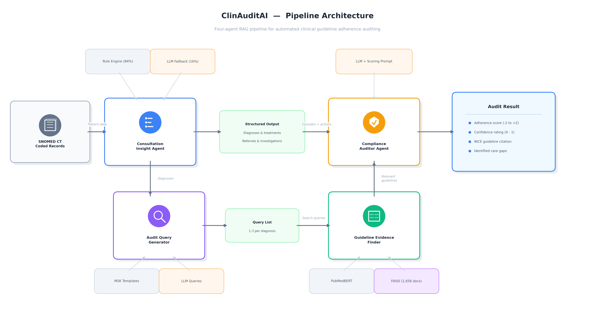

# ClinAuditAI

**Agentic AI for Automated Clinical Guideline Adherence Auditing in Musculoskeletal Primary Care**

ClinAuditAI is the source code accompanying the paper *"ClinAuditAI: Agentic AI for Clinical Guideline Adherence Auditing"* (Raza et al.). It implements a four-agent retrieval-augmented pipeline that audits SNOMED CT-coded primary care records against NICE clinical guidelines and produces a graded, citation-grounded adherence judgement for each diagnosis.

---

## Pipeline Overview



The pipeline consists of four LLM-based agents combined with a PubMedBERT + FAISS retrieval stage:

1. **Consultation Insight Agent** groups SNOMED-coded entries by consultation date and classifies each entry as diagnosis, treatment, referral, investigation, procedure, or administrative. A rule layer covers about 84% of concepts; the remainder are classified by an LLM.
2. **Audit Query Generator** produces 1-3 search queries per diagnosis, using hand-crafted templates for common MSK conditions and LLM-generated queries for rarer cases.
3. **Guideline Evidence Finder** encodes each query with PubMedBERT and retrieves the most relevant NICE guideline passages from a FAISS index, followed by a two-layer relevance filter.
4. **Compliance Auditor Agent** evaluates the diagnosis and documented actions against the retrieved guideline text and returns a 5-level adherence score, a confidence rating, a direct guideline citation, and a list of documented care gaps.

Each judgement is produced on the rubric `+2` Compliant, `+1` Partially Compliant, `0` Not Relevant, `-1` Non-Compliant, `-2` Risky.

---

## Data Access

This repository contains the **source code only**. The following artefacts are **not included in the public release** because they contain (or could reveal) sensitive information and are subject to data-sharing restrictions:

| Artefact | Description |
|----------|-------------|
| `data/msk_valid_notes.csv` | Pseudonymised musculoskeletal patient records (SNOMED-coded entries) |
| `data/guidelines.csv.gz` | NICE clinical guideline corpus used by the retriever |
| `data/guidelines.index` | Pre-built FAISS index over the guideline corpus (can be regenerated from `guidelines.csv.gz`) |
| `data/eval_results/` | Per-patient evaluation outputs |
| Audit and comparison reports | Per-patient HTML / CSV reports generated by the pipeline (written to `exports/`) |

Requests for access can be sent to the author at **anassheikh57@gmail.com**. Requests are reviewed on a case-by-case basis and are subject to applicable data-sharing restrictions, ethical approvals, and institutional agreements.

Once access has been granted, place the files in the project as follows:

```
clinaudit-ai/
└── data/
    ├── msk_valid_notes.csv   # received from authors
    ├── guidelines.csv.gz     # received from authors
    └── guidelines.index      # received from authors, or rebuild via scripts/build_index.py
```

---

## Installation

### Prerequisites

- Docker and Docker Compose
- Python 3.11+
- An OpenAI API key, an Anthropic API key, or a local Ollama installation
- Approximately 2 GB of RAM for the PubMedBERT model

### Setup

```bash
# Clone and enter the repository
git clone https://github.com/anasraza57/clinaudit-ai.git
cd clinaudit-ai

# Configure environment variables (set API key, AI_PROVIDER, etc.)
cp .env.example .env

# Create a virtual environment and install dependencies
python3 -m venv .venv
source .venv/bin/activate
pip install -r requirements.txt

# Start the PostgreSQL database
docker compose up -d db

# Apply database migrations
DB_HOST=localhost alembic upgrade head

# Import the patient records and NICE guideline corpus
DB_HOST=localhost python3 scripts/import_data.py

# Download the PubMedBERT embedding model (one-time, ~440 MB)
python3 -c "from transformers import AutoModel, AutoTokenizer; m='NeuML/pubmedbert-base-embeddings-matryoshka'; AutoTokenizer.from_pretrained(m); AutoModel.from_pretrained(m)"

# Build the FAISS guideline index (one-time, 5-15 minutes on CPU)
python3 scripts/build_index.py

# Start the application
make run
```

The interactive API documentation is available at `http://localhost:8000/docs` once the server is running.

### Selecting a Model Provider

The auditor LLM is selected via the `AI_PROVIDER` environment variable in `.env`:

| Provider | `AI_PROVIDER` | Notes |
|----------|---------------|-------|
| OpenAI | `openai` | Requires `OPENAI_API_KEY`. Default model: `gpt-4o-mini`. |
| Anthropic | `anthropic` | Requires `ANTHROPIC_API_KEY`. |
| Ollama | `ollama` | Local inference. Set `OLLAMA_BASE_URL` and `OLLAMA_MODEL`. |

PubMedBERT is used for embeddings regardless of the auditor model.

---

## Reproducing the Evaluation

The paper reports results from two batch audits over the same 1,000-record sample, one per model. To reproduce:

```bash
# Run the batch audit with the first model (e.g. OpenAI)
# Set AI_PROVIDER=openai in .env, then start the server
curl -X POST "http://localhost:8000/api/v1/audit/batch?limit=1000"
# Note the returned job_id (e.g. 1)

# Switch the auditor model to Mistral via Ollama and restart the server
# Set AI_PROVIDER=ollama, OLLAMA_MODEL=mistral-small in .env
curl -X POST "http://localhost:8000/api/v1/audit/batch?limit=1000"
# Note the returned job_id (e.g. 2)

# System-level metrics (score distribution, adherence rate, mean confidence)
curl "http://localhost:8000/api/v1/evaluation/system-metrics?job_id=1"

# Cross-model agreement (Cohen's kappa, Pearson, confusion matrix, AUROC)
curl "http://localhost:8000/api/v1/evaluation/cross-model-metrics?job_a=1&job_b=2"

# LLM-as-Judge per-agent evaluation (deterministic pat_id ordering)
curl -X POST "http://localhost:8000/api/v1/evaluation/evaluate/agents?model=gpt-4.1-mini&limit=50"

# Self-contained HTML comparison report
curl -o comparison.html "http://localhost:8000/api/v1/reports/export/comparison-html?job_a=1&job_b=2"
```

All evaluation endpoints accept `?job_id=N` or `?model=X` and use deterministic `pat_id` ordering so that the same `offset`/`limit` evaluates the same patients across different models.

---

## Evaluation Results

The system was evaluated on 1,000 randomly sampled MSK consultation records (1,491 clinical entries) using two LLMs in the auditor role: GPT-4.1-mini (cloud-hosted via OpenAI) and Mistral-Small (locally hosted via Ollama). Both processed identical prompts, retrieval parameters, and scoring rubrics, with a 0% pipeline error rate.

### Score Distribution (1,000 records, 1,491 entries)

| Score Category | GPT-4.1-mini | Mistral-Small |
|---|---|---|
| Compliant (+2) | 2 (0.1%) | 0 (0.0%) |
| Partially Compliant (+1) | 283 (19.0%) | 243 (16.3%) |
| Not Relevant (0) | 343 (23.0%) | 269 (18.0%) |
| Non-Compliant (-1) | 862 (57.8%) | 973 (65.3%) |
| Risky (-2) | 1 (0.1%) | 6 (0.4%) |
| **Adherence Rate** | **24.8%** | **19.9%** |
| **Mean Confidence** | **0.87** | **0.89** |

Adherence Rate = (Compliant + Partial) / (total − Not Relevant). The high proportion of Non-Compliant scores reflects the sparsity of coded management data (verbal advice, over-the-counter recommendations, and prescriptions logged in separate systems are not captured in SNOMED-coded entries) rather than unsafe care.

### Cross-Model Agreement (5-class)

| Metric | Value |
|---|---|
| Exact match | 77% |
| Cohen's κ | 0.58 (moderate) |
| Pearson r | 0.75 |

Most disagreements occur between adjacent score levels (`-1` vs `0` and `-1` vs `+1`), consistent with the inherent ambiguity of sparse coded records.

### Per-Agent Evaluation (50 records, 88 entries; LLM-as-Judge)

Quality ratings on a 1-5 scale; IR metrics on a 0-1 scale.

| Metric | GPT-4.1-mini | Mistral-Small |
|---|---|---|
| **Consultation Insight Agent** | | |
| Rule match rate | 1.00 | 1.00 |
| Per-category F1 | 1.00 | 1.00 |
| **Audit Query Generator** | | |
| Relevance | 4.55 | 4.30 |
| Coverage | 3.63 | 3.47 |
| **Guideline Evidence Finder** | | |
| Precision@k | 0.57 | 0.38 |
| Recall@k | 0.95 | 0.85 |
| nDCG@k | 0.82 | 0.65 |
| MRR | 0.79 | 0.60 |
| **Compliance Auditor Agent** | | |
| Reasoning Quality | 4.78 | 4.61 |
| Citation Accuracy | 4.32 | 3.86 |
| Score Calibration | 4.77 | 4.60 |

### Cross-Judge Validation (100 records, 156 diagnoses; LLM-as-Judge, scale 1-5)

Each model's scoring output was evaluated by both models acting as judges, to reduce self-assessment bias.

| Scorer | Judge | Reasoning | Citation | Calibration |
|---|---|---|---|---|
| GPT-4.1-mini | GPT-4.1-mini | 4.77 | 4.46 | 4.79 |
| GPT-4.1-mini | Mistral-Small | 4.75 | 4.56 | 4.73 |
| Mistral-Small | GPT-4.1-mini | 4.37 | 3.22 | 4.51 |
| Mistral-Small | Mistral-Small | 4.58 | 3.81 | 4.56 |

Both judges consistently ranked GPT-4.1-mini higher across all three quality dimensions, with the largest gap in citation accuracy.

Detailed per-patient evaluation outputs and audit reports are not publicly released. See [Data Access](#data-access) for the request procedure.

---

## Project Structure

```
clinaudit-ai/
├── src/
│   ├── ai/             # LLM provider abstraction (OpenAI, Anthropic, Ollama)
│   ├── agents/         # Four pipeline agents (extractor, query, retriever, scorer)
│   ├── api/routes/     # FastAPI route handlers
│   ├── config/         # Pydantic settings
│   ├── models/         # SQLAlchemy database models
│   └── services/       # Pipeline orchestration, reporting, evaluation
├── tests/              # Test suite
├── scripts/            # Data import, FAISS index build, chart export
├── migrations/         # Alembic database migrations
├── docker-compose.yml  # PostgreSQL and application services
├── Dockerfile          # Multi-stage application image
└── Makefile            # Common commands (run `make help`)
```

---

## Citation

If you use ClinAuditAI in your work, please cite the accompanying paper:

```
Raza, A., Cockayne, M., Ortolani, M., Hill, J., and Al-Bander, B.
ClinAuditAI: Agentic AI for Clinical Guideline Adherence Auditing.
```

Full citation details will be updated on publication.

---

## License

The source code in this repository is released under the MIT License. See `LICENSE` for details.

---

## Contact

For questions about the implementation or requests for restricted data, please contact **anassheikh57@gmail.com**.
